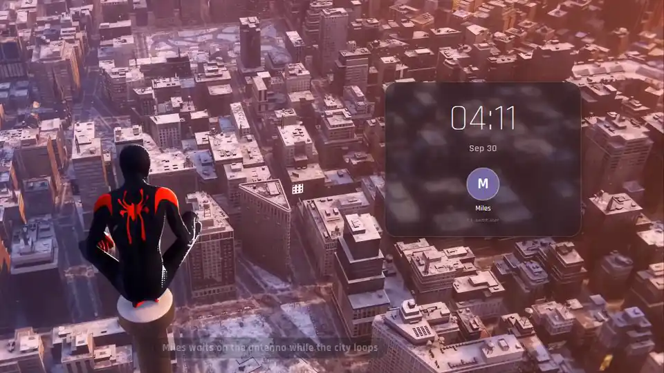
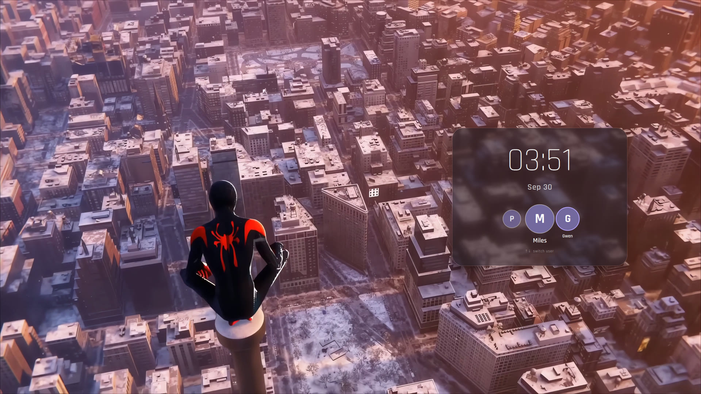
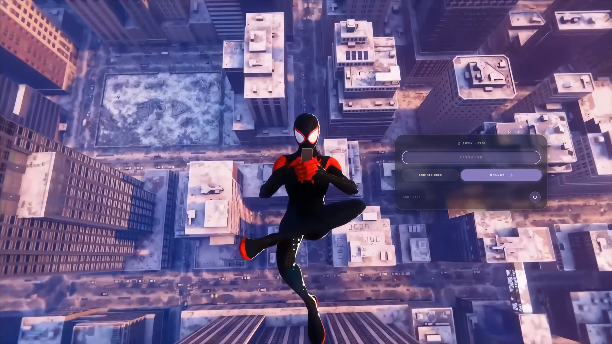

# 🕷️ spidey

A login screen for SDDM where Miles sits on top of an antenna, stares at the city for a bit,
and when you finally click, he jumps. Somewhere on the way down he pulls out his phone, and
that's where you type your password.

I wanted my laptop to feel a little more like New York every time I turned it on. This is the result.



## 🕸️ What happens when you log in

1. **Idle.** The city loops in the background. The panel on the right shows the time, the date
   and whoever logged in last. If there's more than one account on the machine, hover the
   avatar and the others fan out. Pick one with the mouse or with ↑ / ↓.
2. **The jump.** Click anywhere or hit Enter and he goes off the edge. Too slow for you? Just start
   typing your password. He'll skip straight to the phone part and your first letter
   lands in the box.
3. **The phone.** He keeps falling in a slow loop, looking at his screen, while a frosted glass card
   waits for your password. Wrong password and the card shakes at you. `Esc` takes you back up to
   the antenna.

The power button (sleep, restart, shut down) lives in the bottom corner of the password card.

| Waiting on the antenna | Mid-fall, checking his phone |
|---|---|
|  |  |

## 🏙️ Install

You'll need Plasma 6 / SDDM 0.21+ running on Qt 6, plus Qt Multimedia with the FFmpeg backend. On
Ubuntu / Kubuntu that's `qml6-module-qtmultimedia` and `qml6-module-qtquick-effects`.

```bash
git clone https://github.com/Phobby/sddm-spidey-theme.git ~/sddm-themes/spidey

# try it out first, nothing gets changed
sddm-greeter-qt6 --test-mode --theme ~/sddm-themes/spidey
```

Happy with it? Copy it over:

```bash
sudo rsync -a --delete --exclude source/ --exclude .git/ --exclude docs/ \
  ~/sddm-themes/spidey/ /usr/share/sddm/themes/spidey/
sudo chown -R root:root /usr/share/sddm/themes/spidey
```

Then set it in `/etc/sddm.conf.d/` (whichever file already has a `[Theme]` section wins):

```ini
[Theme]
Current=spidey
```

> **Heads up:** don't symlink the theme from your home folder. The `sddm` user usually can't read
> your home directory, so the symlink works in test mode and then quietly fails on the real login
> screen. Ask me how I know.

A couple of things that are normal in test mode: the power buttons don't do anything, and
logging in never goes through. There's no SDDM daemon behind the test window, so the card just
unlocks itself again after a few seconds.

## 🎨 Make it yours

Everything lives in `theme.conf`:

| Key | Default | What it does |
|---|---|---|
| `accentColor` | `#b9a6ff` | The lilac on the password field, the glow and the unlock button |
| `cardOpacity` | `0.55` | How dark the glass is |
| `blurAmount` | `0.8` | How blurry the city is behind the glass (0 to 1) |
| `cardWidth` | `0.25` | Card width as a fraction of the screen |
| `panelSide` | `right` | `left` if you'd rather have it on the other side |
| `uiScale` | `1.0` | Scale everything up or down (sizes are based on 1440p) |
| `clockFormat` | `HH:mm` | Use `h:mm AP` for 12-hour time |
| `dateFormat` | `MMM d` | Shows up as "Sep 30" |
| `locale` | `en_US` | Language for the month names |
| `fontFamily` | Rajdhani | Any font you have installed |

## 🎬 Rebuilding the clips

The videos are already in `assets/`, so you don't need this. But if you want to tweak the cut points or
start from scratch, `scripts/prepare_clips.sh` does the whole thing: it downloads the source,
upscales it to 1440p with Real-ESRGAN, cuts the three scenes and builds the loops.

```bash
scripts/prepare_clips.sh                     # full run, needs yt-dlp + ffmpeg (+ a Vulkan GPU for the upscale)
scripts/prepare_clips.sh --reuse-frames      # skip download/upscale, just re-cut
scripts/prepare_clips.sh --upscale lanczos   # no GPU? this works too, just a bit softer
```

The phone loop took the most work. The camera goes back and forth, easing to a stop at each end,
so you never actually see where the loop wraps. If you change the timestamps at the top of the
script, it's worth watching that part again.

## 🕷️ Credits

- Footage is from **Marvel's Spider-Man: Miles Morales** © Sony Interactive Entertainment /
  Insomniac Games. It's here for personal use only. Please don't redistribute the clips.
- Font: [Rajdhani](https://fonts.google.com/specimen/Rajdhani) by Indian Type Foundry (SIL OFL).
- Upscaling: [Real-ESRGAN](https://github.com/xinntao/Real-ESRGAN).

The code and the script are MIT licensed (see [LICENSE](LICENSE)), so take them apart. The footage isn't
covered by that, for obvious reasons. If you build something cool with it, I'd love to see it.

*Anyone can wear the mask.* 🕸️
